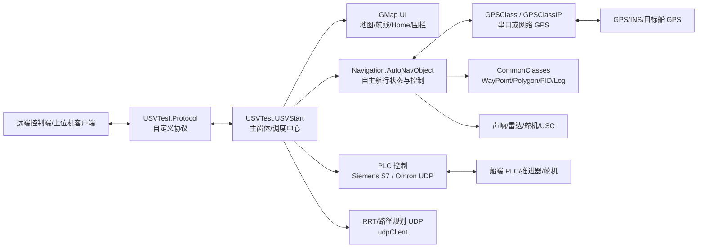
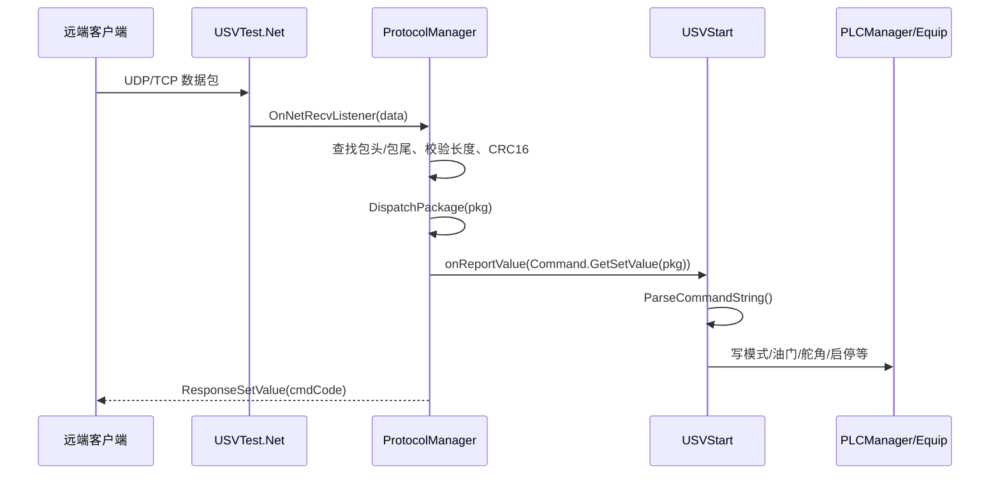

# USV Server Architecture

本文档基于当前仓库代码梳理，描述 USV 地面站/服务器程序的现状架构、主要模块、运行入口、通信链路和设备接口。

## 1. 系统定位

当前解决方案是一个基于 .NET Framework 的 WinForms 船舶地面站/服务器程序集合。核心职责包括：

- 地图显示、航线规划、Home 点设置、围栏/障碍物绘制。
- 接收远端控制命令，解析后转为本地状态更新或 PLC 控制指令。
- 从 GPS/INS/PLC 等设备读取状态。
- 将船舶位置、航速、航向、系统状态等通过自定义协议上报。
- 提供调试、手动控制、状态查看、故障记录等辅助窗体。

> 注意：当前 `USV_Server` 项目本身只是一个空 WinForms 壳。实际主程序是 `USVTest`。

## 2. 技术栈

- 语言/平台：C#，.NET Framework 4.7.2/4.8，WinForms。
- 地图：GMap.NET、自定义 GMap 绘制与 Marker 库。
- 通信：UDP/TCP 自定义封装、自定义二进制协议、CRC16。
- PLC：
  - Siemens S7：`S7.Net`。
  - Omron/FINS 风格 UDP：仓库内 `Equip` 实现。
- 数据序列化：Newtonsoft.Json。
- 数据模型/辅助：CommonClasses、SharedResource。
- 其他设备：串口 GPS、网络 GPS、INS TCP、声呐、舵机控制器、USB/USC。

## 3. 解决方案项目

| 项目 | 类型 | 角色 |
| --- | --- | --- |
| `USVTest` | WinExe | 核心地面站/服务器主程序，入口窗体为 `USVStart`。 |
| `Navigation` | Exe/库式使用 | 航行控制、GPS、PLC、避障、声呐、舵机等设备与算法封装。 |
| `CommonClasses` | Exe/库式使用 | 公共模型和工具，如 `WayPoint`、`PolygonWayPoint`、PID、日志、地理计算。 |
| `GMapTools` | Library | GMap 地图工具、距离/删除/临时线等辅助绘制。 |
| `GMapDrawTools` | Library | 圆形、折线、矩形等地图绘制工具。 |
| `GMapMarkerLib` | Library | 自定义地图 Marker、动画 Marker、方向 Marker、路径 Marker。 |
| `SharedResource` | Exe/库式使用 | 共享资源/配置类型。 |
| `DataReadTCPAndSerialport` | Exe | 独立调试/采集程序，串口读取角度、GPS/PLC/TCP/UDP 测试。 |
| `SQLDataSave` | Exe/库式使用 | 数据库更新/保存辅助。 |
| `ModbusLib` | Library | Modbus 协议、TCP/RTU、串口/网络通信库。 |
| `CommonControls` | Library | 通用 WinForms 控件。 |
| `UsbWrapper` / `Usc` / `Sequencer` | Library | USB/Pololu Maestro/序列脚本相关控制支持。 |
| `USV_Server` | WinExe | 当前未纳入 `.sln`，只启动空 `Form1`，不是主业务入口。 |
| `StudyMoth` / `UsvOnBoard` | Exe | 当前解决方案未引用，像是历史或旁支工程。 |

## 4. 高层架构



### 分层视角

| 层 | 主要代码 | 职责 |
| --- | --- | --- |
| UI/应用层 | `USVTest/USVStart.cs`、各 WinForms 窗体 | 用户操作、地图交互、命令分发、状态显示。 |
| 协议层 | `USVTest/Protocol/*` | 封包/解包、CRC、命令枚举、发送队列、协议事件。 |
| 网络层 | `USVTest/Net/*` | UDP/TCP client/server/broadcast 抽象。 |
| 航控领域层 | `Navigation/AutoNavObject.cs` | 自动航行、航点、Home、GPS 状态、避障/声呐相关状态。 |
| 设备适配层 | `Navigation/GPSClass*.cs`、`PLCManager.cs`、`Equip.cs`、`SiemensS7.cs` | 串口、TCP/UDP、PLC、舵机等硬件访问。 |
| 公共模型/工具层 | `CommonClasses/*` | 航点、地理计算、PID、日志、序列化。 |
| 地图扩展层 | `GMapTools`、`GMapDrawTools`、`GMapMarkerLib` | 地图绘制、Marker、路线展示。 |

## 5. 运行入口

### 实际主入口

`USVTest/Program.cs`

```csharp
Application.Run(new USVStart());
```

`USVStart` 是当前业务核心。构造函数中完成：

- 加载地图图标资源。
- 初始化地图绘制工具和图层。
- 初始化通信：`CommunicationInit()`。
- 初始化 PLC 定时器对象。
- 初始化 `AutoNavObject`、航点列表、Home 点对象。
- 初始化 XBOX/手动控制相关变量。
- 初始化航速 PID。

### 非核心入口

`USV_Server/Program.cs` 启动 `Form1`，但 `Form1` 当前没有业务逻辑，且 `USV_Server.csproj` 未出现在主 `.sln` 中。

`DataReadTCPAndSerialport/Program.cs` 是独立控制台程序，主要用于串口/PLC/INS/GPS 调试和采集，不是主地面站入口。

## 6. 通信协议

协议代码位于 `USVTest/Protocol`。

### 封包格式

由 `Command.Pack()` 生成：

```text
head      len      data                  crc16      tail
0xff      1 byte   commandType + payload 2 bytes    ee fc ff ea
```

- 包头：`0xff`
- 包尾：`ee fc ff ea`
- 长度：去掉包头和包尾后的长度。
- CRC：`CRC16.GetCRC(data)`。
- 数据区：第 1 字节为命令类型，第 2 字节为命令码，后面是 ASCII 或字节数据。

### 命令类型

`Command.CommandType`

| 类型 | 值 | 含义 |
| --- | --- | --- |
| `SetValue` | `0x01` | 远端下发控制/设置命令。 |
| `GetValue` | `0x02` | 远端请求读取数据。 |
| `ReportValue` | `0x03` | 本端主动上报数据。 |

### 控制命令

`Command.CommandCode` 包含：

- 通信：`Connect`、`DisConnect`
- 航行模式：`ModeSwitch`、`GroundStationMode`
- 急停/复位/报警：`EmergencyStop`、`EmergencyReset`、`AlarmReset`
- 启停：`Start`、`Stop`
- 发动机：`PowerOn`、`EngineStart`、`EngineStop`、`EngineShutdown`
- 推进/舵角：`LeftThrottle`、`RightThrottle`、`LeftSteeringAngle`、`RightSteeringAngle`
- 任务：`PathPlanningPoint`、`Fence`、`NavigateSpeed`
- 功能：`NavigationRadar`、`SignalLight`、`PCSelection`、`GPSSelection`、`AutoGoHome`、`ObstacleAvoidance`、`Tracking`、`RotateInPlace`

### 协议处理链路



当前 `ProtocolManager.Connect()` 使用：

```csharp
netManater.Open(CommNetType.NetType.UDP_server, "127.0.0.1", 2011);
```

也就是说现状默认监听本机 `127.0.0.1:2011` 的 UDP server。

## 7. 主业务流

### 7.1 远端下发控制命令

入口：`USVStart.onReportValue(string value)`

流程：

1. `ProtocolManager` 收到 `SetValue`。
2. `Command.GetSetValue(pkg)` 把命令解析成类似 `CommandCode: value` 的字符串。
3. `USVStart.onReportValue()` 调用 `Command.ParseCommandString()`。
4. 根据命令类型执行对应逻辑。

典型映射：

| 命令 | 当前处理 |
| --- | --- |
| `ModeSwitch` | 更新 `usvMode`，可写 `DB1501.DBW2`。 |
| `Start` | `autoNavObject.AutoNavOn = true`，可写 `DB1501.DBW24/28 = 1`。 |
| `Stop` | `AutoNavOn = false`，写左右油门为 0。 |
| `LeftThrottle` | 模式为 3 时写 `DB1501.DBW14/18`，并根据油门启停推进。 |
| `LeftSteeringAngle` | 模式为 3 时写 `DB1501.DBW16`。 |
| `PathPlanningPoint` | 解析航点字符串并显示规划路径。 |
| `NavigateSpeed` | 设置 `autoNavObject.navigateSpeed`，写左右油门。 |
| `DisConnect` | 调用 `CommunicationDisC()`。 |

### 7.2 GPS 数据上报

入口：`AutoNavObject.GPS1IP/GPS1Serial.GPSDataUpdated` 事件。

`USVStart.AutoNavObjectInit()` 订阅 GPS 更新事件，GPS 更新后进入：

```text
GPS 更新 -> USVStart.dBQiyYHj5t() -> Yvrizab0QG()
```

`Yvrizab0QG()` 做三件事：

1. 从 `autoNavObject` 读取 `GPS1Lat/GPS1Long/GPS1TrueHeading/GPS1GroundSpeed`。
2. 组装 `ShipData` 并序列化为 JSON。
3. 如果 `IsConnect == true`，通过 `Command.SendReportValue(gpsData, GPS1)` 主动上报。
4. 调用 `OnDataReceived(shipData)` 更新地图船舶位置。

### 7.3 航线规划与发送

相关入口：

- `gMapControl1_Click`
- `gMapControl1_MouseClick`
- `btnPathPlanning_Click`
- `btnSave_Click`
- `btnPathSend_Click`
- `AddWayPoints`
- `DisplayPlanningPath`

主要状态：

- `SettingRoutePoint`：是否处于航点绘制模式。
- `polygonWayPointsList`：地图上绘制/保存的航点集合。
- `WayPointList`：接收远端路径点后用于自动航行的航点集合。
- `wayPointsMessage`：保存/发送路径规划字符串。

路径发送逻辑：

- `btnPathSend_Click()` 将 `route;{wayPointsMessage}` 通过 `udpClient.SendData()` 发送。
- 若启用虚拟障碍物，也会发送矩形/圆形障碍数据。

### 7.4 PLC 控制链路

当前存在两套 PLC 访问方式。

#### Siemens S7

位置：`Navigation/PLCManager.cs`、`Navigation/SiemensS7.cs`

特点：

- 使用 `S7.Net`。
- `PLCManager.Initialize(ip)` 初始化。
- `PLCManager.Connect()` 连接。
- `PLCManager.WriteInt(address, value)` 写 DB 地址。
- `PLCManager.StartReadingBytes(db, start, count, interval)` 可定时读取字节并触发 `BytesRead`。

主窗体中常见地址：

| 地址 | 当前用途 |
| --- | --- |
| `DB1501.DBW2` | 模式设置。 |
| `DB1501.DBW14` | 左/一侧油门或航速。 |
| `DB1501.DBW18` | 右/另一侧油门或航速。 |
| `DB1501.DBW16` | 舵角。 |
| `DB1501.DBW24` | 推进启动相关。 |
| `DB1501.DBW28` | 推进启动相关。 |

#### Omron/FINS 风格 UDP

位置：

- `USVTest/PLC/Equip.cs`
- `Navigation/Equip.cs`
- `DataReadTCPAndSerialport/Equip.cs`

特点：

- UDP，默认端口 `9600`。
- `Read(block, start, len)` 读取 PLC 字。
- `Write(block, start, buff)` 写 PLC 字。
- 常见块地址：`8000`、`8100`、`8200`、`8300`。

`USVTest/PLC/PLCCommunication.cs` 封装左右 PLC：

- 左 PLC：`192.168.0.102`
- 右 PLC：`192.168.0.101`
- 读取：左 `8000`，右 `8200`
- 写入：左 `8100`，右 `8300`

## 8. 自主航行模块

核心类：`Navigation/AutoNavObject.cs`

主要职责：

- 管理 GPS1/GPS2 的串口或网络连接。
- 保存当前船位、航向、航速、卫星数、姿态等。
- 管理航点列表、当前航点索引、过点半径。
- 计算到航点/Home 的距离、方位、转向角。
- 保存自动航行、返航、避障、声呐跟踪等开关状态。
- 提供到达航点、完成航线、出围栏、障碍物检测等事件。

关键属性/字段：

| 名称 | 含义 |
| --- | --- |
| `AutoNavOn` | 自动航行开关。 |
| `Waypoints` | 普通航点列表。 |
| `Polygon` | 多边形/规划航点列表。 |
| `HomeWaypoint` | Home 点。 |
| `wp_Radius` | 过点半径。 |
| `GPS1Lat/GPS1Long` | 当前 GPS1 坐标。 |
| `GPS1TrueHeading` | 当前航向。 |
| `GPS1GroundSpeed` | 当前地速。 |
| `navigateSpeed` | 目标航速/油门参考。 |
| `PlcConnect` | PLC 连接状态。 |
| `ObstacleAvoidanceOn` | 避障开关。 |
| `AcousticModemTrackingOn` | 声呐跟踪开关。 |

## 9. 地图与 UI 模块

核心窗体：`USVTest/USVStart.cs`

主要 UI/地图能力：

- 船舶图标显示：`GMapMarkerDirection`。
- Home 点显示。
- 目标点/目标船显示。
- 航行轨迹、规划路径、实时路径显示。
- 圆形/矩形/多边形障碍物绘制。
- 路径保存、打开上一次路径、清除路径点。
- 路径规划数据发送。
- 状态窗体、故障窗体、电脑控制窗体打开。

相关库：

- `GMapTools`：地图辅助工具。
- `GMapDrawTools`：绘制工具。
- `GMapMarkerLib`：自定义 Marker。

## 10. 独立采集/调试程序

项目：`DataReadTCPAndSerialport`

现状入口 `Program.Main()`：

- 打开串口 `COM6`，波特率 `115200`。
- 周期性发送 Modbus/串口读取命令。
- 读取 9 字节数据。
- 从返回数据解析角度。
- 将角度写入 PLC。

该项目还包含：

- GPS 串口读取。
- INS TCP 客户端。
- PLC UDP/TCP 客户端。
- Modbus RTU Master。
- SQL 数据读写测试。

判断：它更像现场调试/设备桥接程序，而不是主地面站的一部分。

## 11. 配置和硬编码点

当前代码中存在较多硬编码配置，后续建议统一迁移到配置文件或设备配置界面。

| 位置 | 当前值/含义 |
| --- | --- |
| `USVStart.CommunicationInit()` | `127.0.0.1:2011` UDP server。 |
| `AutoNavObjectInit()` | GPS1 IP `192.168.1.130`，端口 `9904`。 |
| `AutoNavObjectInit()` | 目标 GPS 串口 `COM14`，波特率 `9600`。 |
| `USVTest/PLC/PLCCommunication.cs` | 左/右 PLC IP：`192.168.0.102`、`192.168.0.101`。 |
| `DataReadTCPAndSerialport/Program.cs` | 串口 `COM6`，波特率 `115200`。 |
| `PLCManager.WriteInt(...)` 调用点 | 多处 Siemens DB 地址硬编码。 |

## 12. 当前架构风险

### 主程序命名混乱

仓库名和 `USV_Server` 项目暗示主程序，但实际主入口是 `USVTest`。这会让新维护者误判。

建议：

- 将 `USVTest` 重命名为更明确的 `USVGroundStation` 或 `USVServerApp`。
- 或把 `USV_Server` 项目移除/合并/重新指向主窗体。

### UI 与业务逻辑耦合较重

`USVStart.cs` 同时承担：

- UI 初始化。
- 地图绘制。
- 协议连接。
- 命令解析。
- PLC 写入。
- GPS 上报。
- 路径规划数据管理。

建议逐步拆分：

- `CommunicationService`
- `CommandDispatcher`
- `TelemetryService`
- `NavigationService`
- `PlcControlService`
- `MapRouteService`

### PLC 访问实现重复

`Navigation/Equip.cs`、`USVTest/PLC/Equip.cs`、`DataReadTCPAndSerialport/Equip.cs` 内容高度相似。

建议保留一个设备适配库，例如放入 `Navigation` 或新建 `DeviceAdapters`，其他项目引用它。

### 协议可靠性逻辑被弱化

`ProtocolManager` 中原有等待响应、超时、重发逻辑部分被注释；当前发送后会清空队列。

建议明确协议模式：

- 如果是无确认 UDP 上报：删除无效重试逻辑，简化为 fire-and-forget。
- 如果是可靠命令通道：恢复 ACK、超时、重发、序列号。

### 配置硬编码

IP、端口、串口、PLC 地址散落在代码里。

建议统一配置：

- `App.config`
- JSON 配置文件
- WinForms 设置界面
- 按船号/设备号管理配置

### 生成产物仍在仓库内

当前仓库包含大量 `bin/obj/packages` 产物和依赖缓存。它们会干扰搜索、增加仓库体积，也容易误判为源码。

建议后续增加 `.gitignore` 并清理构建产物。

## 13. 建议的后续重构路线

1. 明确主程序：把 `USVTest` 作为唯一入口，处理 `USV_Server` 空项目。
2. 建立 `docs/` 文档目录：保留本架构文档，补充通信协议文档、PLC 地址表、部署手册。
3. 抽离通信服务：将 `USVStart.CommunicationInit/onReportValue` 迁到单独服务。
4. 抽离 PLC 控制：统一 Siemens/Omron 的接口，避免窗体直接写 DB 地址。
5. 统一设备配置：IP、端口、串口、DB 地址从代码迁到配置。
6. 收敛重复代码：合并重复的 `Equip`、GPS、UDP wrapper。
7. 清理构建产物：移除 `bin/obj` 和无用缓存，保留源码与必要依赖描述。
8. 增加最小测试：协议封包/解包、命令解析、路径点字符串解析、PLC 地址映射。

## 14. 快速定位索引

| 想看什么 | 文件 |
| --- | --- |
| 主程序入口 | `USVTest/Program.cs` |
| 主界面/核心调度 | `USVTest/USVStart.cs` |
| 自定义协议封包/命令定义 | `USVTest/Protocol/Command.cs` |
| 协议收发和解包 | `USVTest/Protocol/ProtocolManager.cs` |
| UDP/TCP 抽象 | `USVTest/Net/NetManager.cs` |
| 自动航行对象 | `Navigation/AutoNavObject.cs` |
| GPS 串口 | `Navigation/GPSClass.cs` |
| GPS 网络 | `Navigation/GPSClassIP.cs` |
| Siemens PLC | `Navigation/PLCManager.cs`、`Navigation/SiemensS7.cs` |
| Omron/FINS UDP PLC | `USVTest/PLC/Equip.cs` |
| 公共航点模型 | `CommonClasses/WayPoint.cs`、`CommonClasses/PolygonWayPoint.cs` |
| 航速 PID | `CommonClasses/SpeedPIDController.cs` |
| 地图绘制工具 | `GMapTools`、`GMapDrawTools`、`GMapMarkerLib` |
| 串口/PLC 调试程序 | `DataReadTCPAndSerialport/Program.cs` |

